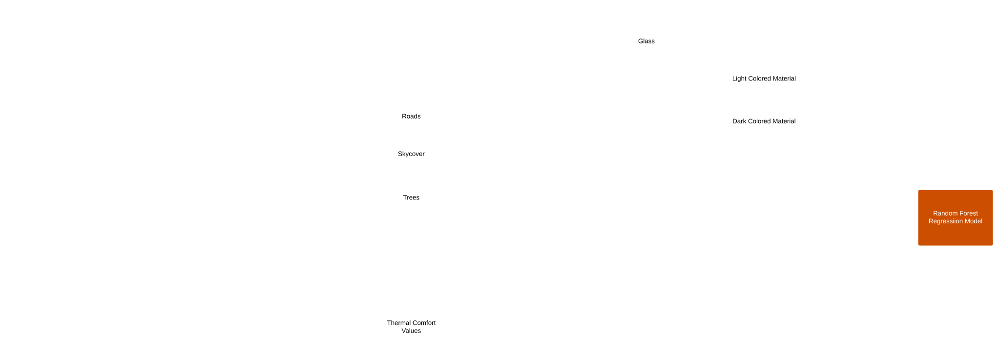

<!-- Improved compatibility of back to top link: See: https://github.com/GITHUBNAME/PROJECTNAME/pull/73 -->
<a name="readme-top"></a>

[![Contributors][contributors-shield]][contributors-url]
[![Forks][forks-shield]][forks-url]
[![Stargazers][stars-shield]][stars-url]
[![Issues][issues-shield]][issues-url]
[![MIT License][license-shield]][license-url]
[![LinkedIn][linkedin-shield]][linkedin-url]


<!-- PROJECT LOGO -->
<br />
<div align="center">
  <a href="https://github.com/AishArun/PROJECTNAME">
    
  </a>

  <h3 align="center"> PROJECTNAME </h3>

  <p align="center" style="font-weight: bold;">
    IAAC: AI in Urbanism 2022-23
    <br />
    <a href="https://colab.research.google.com/github/AishArun/PROJECTNAME/blob/main/src/NOTEBOOKNAME.ipynb">View Demo</a>
    ·
    <a href="https://github.com/AishArun/PROJECTNAME/issues">Report Bug</a>
    ·
    <a href="https://github.com/AishArun/PROJECTNAME/issues">Request Feature</a>
  </p>
</div>


<!-- TABLE OF CONTENTS -->
<details>
  <summary>Table of Contents</summary>
  <ol>
    <li>
      <a href="#about-the-project">About The Project</a>
      <ul>
      <li><a href="#intro">Intro</a></li>
        <li><a href="#built-with">Built With</a></li>
        <li><a href="#methodology">Methodology</a></li>
      </ul>
    </li>
    <li>
      <a href="#getting-started">Getting Started</a>
      <ul>
        <li><a href="#prerequisites">Prerequisites</a></li>
        <li><a href="#usage">Usage</a></li>
      </ul>
    </li>
    <li><a href="#challenges">Challenges</a></li>
    <li><a href="#future-work">Future work</a></li>
    <li><a href="#license">License</a></li>
    <li><a href="#contact">Contact</a></li>
    <li><a href="#team">Team</a></li>
    <ul>
        <li><a href="#supervisors">Supervisors</a></li>
      </ul>
    <li><a href="#acknowledgements">More acknowledgements</a></li>
  </ol>
</details>


<!-- ABOUT THE PROJECT -->
## About The Project


Project developed under the course AI in Urbanism 2022-23 in [IAAC](https://iaac.net/).

ThermoVision: Predicting Urban Comfort Zones

ThermoVision is a predictive tool intended to simplify the complex correlation between the built environment and thermal comfort. It utilizes SegFormer, a machine learning model for semantic segmentation, to extract features from Barcelona's street view images. It then uses this data to train the Random Forest Regression model to predict the thermal comfort at various locations, and offers insights to urban planners, architects, environmental researchers, and policymakers to help understand and analyses these thermal landscapes.

### Intro

ThermoVision is a predictive tool that leverages machine learning to gauge thermal comfort in urban landscapes. Urban areas often struggle with uneven thermal comfort due to varied building topologies , building  materials and vegetation and  understanding these thermal landscapes is challenging due to their complexity. ThermoVision bridges the gap between visual data and thermal comfort, allowing users to understand the impact of the built environment on these thermal landscapes. Through the use of SegFormer, a transformer-based model for semantic segmentation,  features of the built environment are extracted from 360 degree street level images, the Random Forest Regression Model, is trained and tested to predict thermal comfort in different locations. For this project, all training datasets are collected from Barcelona, Spain. The beneficiaries of this project include urban planners, architects, environmental researchers, and policymakers who are seeking to create more comfortable and sustainable urban environments

<p align="right">(<a href="#readme-top">back to top</a>)</p>


### Built With


* [python3](https://www.python.org/)
* [HTML](https://developer.mozilla.org/en-US/docs/Web/HTML)
* [sklearn](https://scikit-learn.org/stable/)
* [HuggingFace](https://huggingface.co/)
* [Mapbox](https://www.mapbox.com/)
* [GoogleStreetMaps](https://mapsplatform.google.com/)
* [Colab](https://colab.research.google.com/)

<p align="right">(<a href="#readme-top">back to top</a>)</p>


### Methodology




<!-- GETTING STARTED -->
## Getting Started

<a href="https://colab.research.google.com/github/AUTHORNAME/PROJECTNAME/blob/main/src/NOTEBOOKNAME.ipynb" target="_parent"></a>\
alternatively clone the repo:
```
git clone https://github.com/AUTHORNAME/PROJECTNAME.git
```

### Prerequisites
None
<p align="right">(<a href="#readme-top">back to top</a>)</p>
<!-- USAGE EXAMPLES -->

### Usage

To use the project, run the python notebook in the src folder. 

<p align="right">(<a href="#readme-top">back to top</a>)</p>

## Challenges

While working on the project the following challenges were encountered : 
- Obtaining well stitched 360 degree street views
- Neatly segmented images and labelling

<p align="right">(<a href="#readme-top">back to top</a>)</p>

## Future work

- Ongoing research is being done to deploy the code as an app and predict thermal comfort in various other locations.

<p align="right">(<a href="#readme-top">back to top</a>)</p>

<!-- LICENSE -->
## License

Distributed under the MIT License. See `LICENSE.txt` for more information.

<p align="right">(<a href="#readme-top">back to top</a>)</p>


## Contact

AishArun - [@AishArun](https://github.com/AishArun) - [e-mail](aishwarya.arun@students.iaac.net)

<p align="right">(<a href="#readme-top">back to top</a>)</p>


<!-- ACKNOWLEDGMENTS -->
## Team

<br />
<div style="width:100;" width=100%>
    <div>
        <a href="https://iaac.net">
            
        </a>
     
    </div>
  <h3>Supervisors</h3>
  <br />
    <div style="display:flex; flex-direction: row; flex:wrap; justify-content:space-around;">
        <a href="https://www.linkedin.com/in/angeloschronis/">
          
        </a>
        <a href="https://www.linkedin.com/in/serjoscha-d%C3%BCring-920644173/">
          
        </a>
        <a href="https://www.linkedin.com/in/stanislava-fedorova/">
          
        </a>
    </div>
</div>

## Acknowledgements

<br />
<div>
        <a href="https://iaac.net">
            
        </a>
    </div>
    <br />
* [Best README template](https://github.com/othneildrew/Best-README-Template)

<p align="right">(<a href="#readme-top">back to top</a>)</p>


<!-- MARKDOWN LINKS & IMAGES -->
<!-- https://www.markdownguide.org/basic-syntax/#reference-style-links -->
[contributors-shield]: https://img.shields.io/github/contributors/GITHUBNAME/PROJECTNAME.svg?style=for-the-badge
[contributors-url]: https://github.com/GITHUBNAME/PROJECTNAME/graphs/contributors
[forks-shield]: https://img.shields.io/github/forks/GITHUBNAME/PROJECTNAME.svg?style=for-the-badge
[forks-url]: https://github.com/GITHUBNAME/PROJECTNAME/network/members
[stars-shield]: https://img.shields.io/github/stars/GITHUBNAME/PROJECTNAME.svg?style=for-the-badge
[stars-url]: https://github.com/GITHUBNAME/PROJECTNAME/stargazers
[issues-shield]: https://img.shields.io/github/issues/GITHUBNAME/PROJECTNAME.svg?style=for-the-badge
[issues-url]: https://github.com/GITHUBNAME/PROJECTNAME/issues
[license-shield]: https://img.shields.io/github/license/GITHUBNAME/PROJECTNAME.svg?style=for-the-badge
[license-url]: https://github.com/GITHUBNAME/PROJECTNAME/blob/master/LICENSE.txt
[linkedin-shield]: https://img.shields.io/badge/-LinkedIn-black.svg?style=for-the-badge&logo=linkedin&colorB=555
[linkedin-url]: https://linkedin.com/in/stanislava-fedorova
[product-screenshot]: assets/screenshot.png


